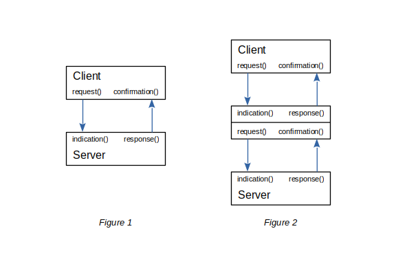

.. console.py sample application

.. _console.py:

console.py
==========

This application accepts a line of input from `stdin`, converts it to uppercase,
and echos it back to `stdout`.  But more than that, it is a template for other
types of applications.

Client/Server Pattern
---------------------

This pattern is a way to make module instances work in layers that follow
**Clause 5.1.1 Confirmed Application Services** but rather than horizontal as
shown in **Figure 5-3** vertical in a stack.

When an instance of a `Client` wants to make a request, which the BACnet standard
calls a **CONF_SERV.request primitive**, it calls a `request()` method and
passes the Protocol Data Unit (PDU) as a parameter.  The `Server` instance
will be notified of this **CONF_SERV.indication primitive** by having its
`indication()` method called *which must be provided by a subclass*.
See *Figure 1*.

When the `Server` instance has content to return to the `Client`, it calls its
`response()` method and the client will have its `confirmation()` method called
*which must be provided by a subclass*.

*Figure 2* shows an example where a single object in the middle of a stack can
be both a client and a server at the same time.  The datatypes of a particular
client and server pair must match, but the datatypes used by the server side
of an object (the top half of the figure) are not the same as the client side
(the bottom half of the figure).

The `request()` to `indication()` message passing is termed :term:`downstream`
and the `response()` to `confirmation()` is termed :term:`upstream`.

.. note::

    For confirmed services it is expected that a downstream request
    will be matched with an upstream response, but this is not part of the
    client/server pattern which is only exchanging PDUs.  For example, a
    Who-Is Request (Clause 16.10.1) is sent downstream by the application
    layer of a client and is also received upstream by its peers.

Application Code
----------------

This description of the application code is in different related chunks rather
than being a strict walk though. Starting with basic importing::

    import asyncio

    from typing import Callable

    from bacpypes3.settings import settings

The `settings` are an object that will start out containing simple BACpypes3
options and will be expanded in other examples.  Next is debugging::

    from bacpypes3.debugging import bacpypes_debugging, ModuleLogger

    ...

    # some debugging
    _debug = 0
    _log = ModuleLogger(globals())

These pieces are built on the built-in `logging` module to provide a way to
debug application content.  This application uses the `ArgumentParser` which is
extended from the built-in class and includes and processes debugging options::

    from bacpypes3.argparse import ArgumentParser

This application uses the `Console` class for interaction with the user and
references a `ConsolePDU` for "receiving input" (lines of text from the user
interactively or from a re-directed input file or pipe) and "sending output"
(also lines of text)::

    from bacpypes3.console import Console, ConsolePDU

The `Console` is a subclass of `Client` so it sits at the top of the stack
and will send the console input :term:`downstream` to some `Server` instance,
and accept :term:`upstream` packets from the server and print or write it.

Rather than sending or receving content through sockets on a network, this
sample accepts the content, translates it to uppercase, and sends it back::

    from bacpypes3.comm import Server, ...

    @bacpypes_debugging
    class Echo(Server[ConsolePDU]):
        async def indication(self, pdu: ConsolePDU) -> None:
            ...
            if pdu is None:
                return

            # send the uppercase content back up the stack
            await self.response(pdu.upper())

The main function creates instances of these two objects, binds them together,
and then waits for the console to say it is finished.  Everything else happens
via `asyncio`::

    # build a very small stack
    console = Console()
    echo = Echo()

    # bind the two objects together, top down
    bind(console, echo)

    # run until the console is done, canceled or EOF
    await console.fini.wait()

Running the sample
------------------

Running the application doesn't look like a whole lot is going on, Ctrl-D or
the platform end-of-file, or Ctrl-C to quit::

    $ python3 console.py 
    > Hi there!
    HI THERE!
    > 

The console input is after the prompt and it accepts input from a file or pipe::

    $ echo "Hi there!" | python3 console.py 
    HI THERE!

Debug a little
--------------

Turning on debugging generates some simple log messages for the `__main__`
logger.  The first part is some basic initialization stuff::

    $ python3 console.py --debug
    DEBUG:__main__:args: Namespace(loggers=False, debug=[], color=None, route_aware=None)
    DEBUG:__main__:settings: {'debug': ['__main__'], 'color': False,
        'debug_file': '', 'max_bytes': 1048576, 'backup_count': 5,
        'route_aware': False, 'cov_lifetime': 60, 'config': {}
        }
    DEBUG:__main__:console, echo: <bacpypes3.console.Console object at 0x7f3c35b99960>, <__main__.Echo object at 0x7f3c35cfae00>

The next piece has the input after the prompt, then shows that the `indication()`
method of the `Echo` class instance was called with the content::

    > Hi there!
    DEBUG:__main__.Echo:indication 'Hi there!'

If the method had any other debugging it would be shown here.  After it sends
the string back up the stack, it is printed by the `Console` class instance::

    HI THERE!

Last but not least, the end-of-file from the console is sent down the stack as
`None` and the application terminates::

    >
    DEBUG:__main__.Echo:indication None

Debug a little more
-------------------

Now turn on debugging for the main application and console class at the same
time by listing the name of modules and/or classes::

    $ python3 console.py --debug __main__ bacpypes3.console.Console

In addition to the logging lines above, there are some new ones.  This is from
the initialization of the `Console` class with the values of its optional
arguments::

    DEBUG:bacpypes3.console.Console:__init__ '> ' 'console.py.history' None

When the `Echo` class sends its content upstream, the `Console` class has its
`confirmation()` method called::

    > Hi there!
    DEBUG:__main__.Echo:indication 'Hi there!'
    DEBUG:bacpypes3.console.Console:confirmation 'HI THERE!'
    HI THERE!

And for the end-of-file exception there is some additional logging::

    > DEBUG:bacpypes3.console.Console:console_input exception: EOFError
    DEBUG:__main__.Echo:indication None

See the section on :ref:`debugging` for more debugging options.
